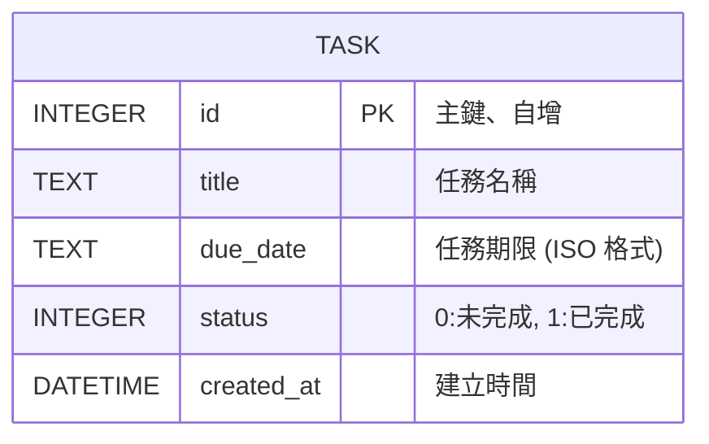

# 資料庫設計 — 任務管理系統

## 1. 實體關係圖 (ER 圖)


## 2. 資料表詳細說明

### `tasks` 表
主要用來儲存使用者的待辦任務清單。
- `id` (INTEGER, PK): 唯一識別碼，寫入時自動遞增。
- `title` (TEXT, NOT NULL): 任務名稱 / 內容，為必填欄位。
- `due_date` (TEXT): 任務截止日期，存儲 ISO 8601 日期格式字串，用字串直接排序與比對。
- `status` (INTEGER): 代表任務狀態，預設為 `0`。`0` 代表未完成，`1` 代表已完成。
- `created_at` (DATETIME): 任務被建立的時間，資料庫產出時預設寫入 `CURRENT_TIMESTAMP`。

## 3. SQL 建表語法
存放於 `database/schema.sql` 之中。可利用此語法建立 SQLite 資料庫對應架構：
```sql
CREATE TABLE IF NOT EXISTS tasks (
    id INTEGER PRIMARY KEY AUTOINCREMENT,
    title TEXT NOT NULL,
    due_date TEXT,
    status INTEGER DEFAULT 0,
    created_at DATETIME DEFAULT CURRENT_TIMESTAMP
);
```

## 4. Python Model 程式碼
實作位於 `app/models/task.py`，使用 Python 原生專案的 `sqlite3` 提供任務的 CRUD 操作。
為 Controller 提供的公開介面方法包含：
- `create_task()`
- `get_all_tasks()`
- `get_task_by_id()`
- `update_task()`
- `toggle_task_status()`
- `delete_task()`
