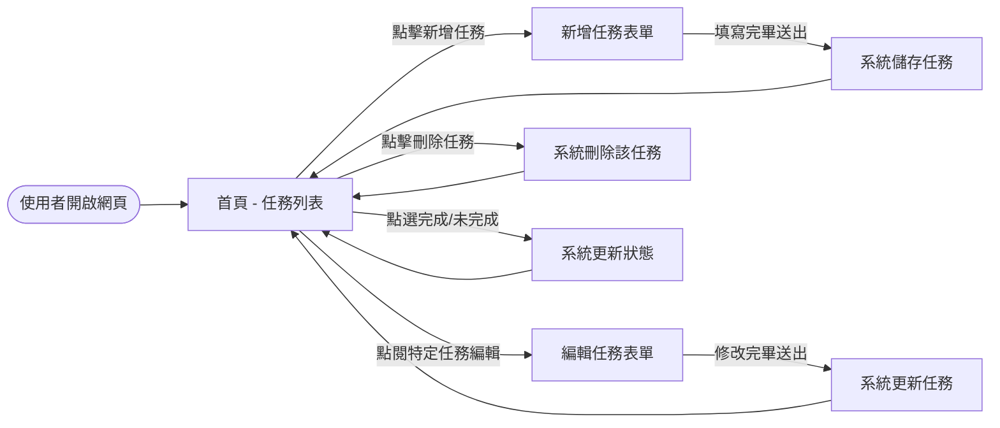
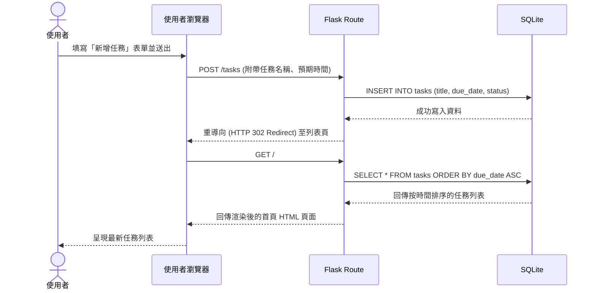

# 流程圖 — 任務管理系統

## 1. 使用者流程圖（User Flow）

以下描述使用者在本系統中的操作路徑與選擇：

## 2. 系統序列圖（Sequence Diagram）

以下描述「使用者嘗試新增一筆任務」時，系統各個元件如何互動與傳遞資料：

## 3. 功能清單對照表

本系統各核心功能所對應的 URL 路徑與 HTTP 方法如下，供後續 API 與 Flask 路由實作參考：

| 功能名稱 | URL 路徑 | HTTP 方法 | 說明 |
| --- | --- | --- | --- |
| 瀏覽首頁任務列表 | `/` | GET | 查詢資料庫，回傳按時間排序的任務清單 |
| 新增任務頁面 | `/tasks/new` | GET | 顯示用於填寫新任務內容的網頁表單 |
| 處理新增任務 | `/tasks` | POST | 接收來自表單的資料並存入資料庫 |
| 編輯單一任務頁面 | `/tasks/<id>/edit` | GET | 查詢特定 ID 任務，顯示編輯用表單 |
| 處理更新任務 | `/tasks/<id>` | POST | 接收變更後的資料，覆寫回該筆記錄 (網頁表單常以 POST 替代 PUT) |
| 處理刪除任務 | `/tasks/<id>/delete` | POST | 接收刪除請求並移除該筆記錄 |
| 切換完成狀態 | `/tasks/<id>/toggle` | POST | 翻轉指定筆數任務的「已完成/未完成」狀態 |
